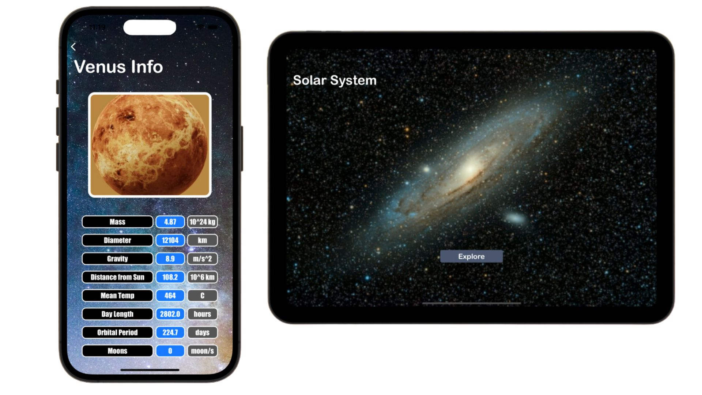

# SolarSystemPlanets

## App Links

App Store: https://apps.apple.com/au/app/searchaplace/id6452240296

## Languages & Frameworks

Swift / UiKit 

## App Description

Developed using Swift with an emphasis on UIKit. Features: Enables users to search for nearby places based on their current location.Lists relevant places closest to the user with details like address,distance, route, and photos. Leverages the Foursquare API to fetch extensive placerelatedinformation. Integrates MapKit and Apple’s CoreLocation for map visualization androuting functionalities. Utilised UIKit elements including Table View, Navigation Controllers,and Collection Views.

